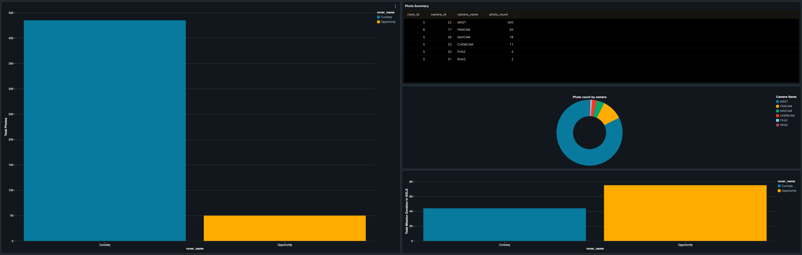
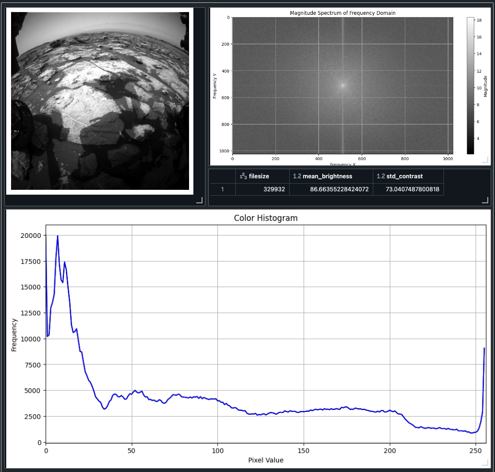
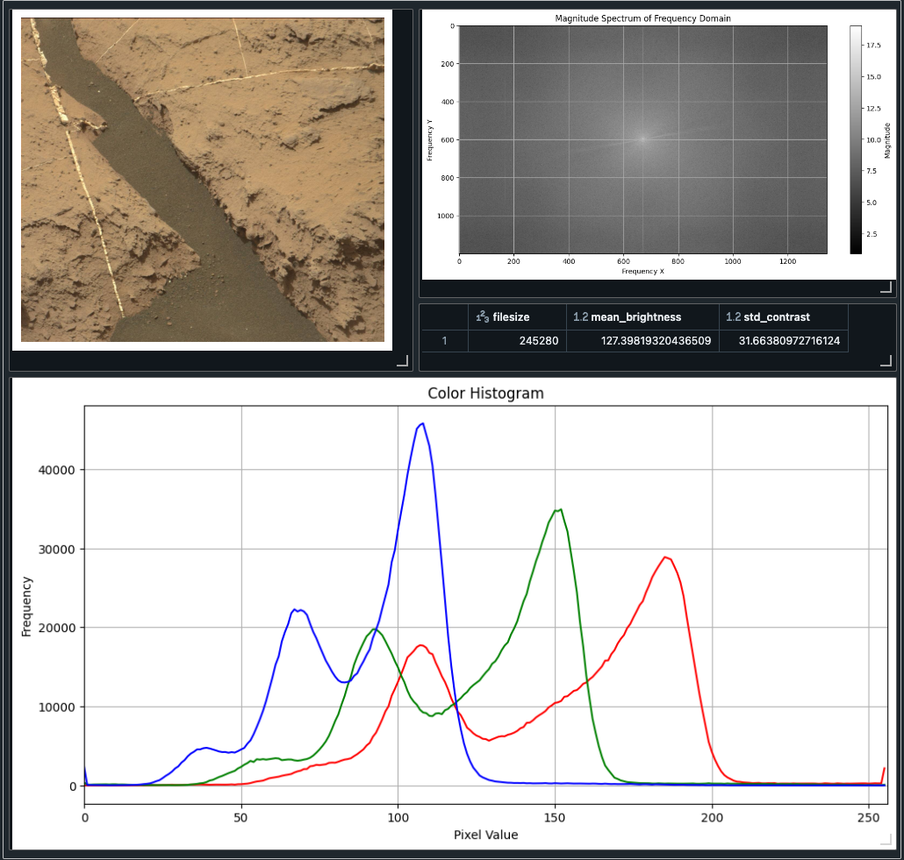

# Mars Rover Data ETL and Analytics

This repository contains an ETL (Extract, Transform, Load) pipeline for NASA Mars Rover data, implemented in Databricks. The project leverages the medallion architecture with AWS S3 for efficient data storage and transformation. The pipeline processes data from NASA's Mars Rover API, performs analytics, and visualizes data through interactive dashboards.

## Project Overview

### ETL Pipeline

1. **Data Extraction**:
   - Extract Mars Rover data from NASA's Mars Rover API.
   - The data includes rover and camera information, as well as URLs to the individual images.

2. **Data Storage**:
   - Utilize the medallion architecture to store data in three layers:
     - **Bronze Layer**: Raw, unprocessed data.
     - **Silver Layer**: Cleaned and transformed data.
     - **Gold Layer**: Aggregated and refined data for analytics.

3. **Data Transformation**:
   - Clean and preprocess data.
   - Perform various transformations to prepare data for analysis.

4. **Data Analytics**:
   - Analyze and display rover and camera data, such as mission durations, photo counts per camera, and more.
   - Compute statistics for individual images, including RGB intensity and frequency domain intensity.

5. **Dashboard Creation**:
   - Develop interactive dashboards to visualize rover and camera data. The camera and rover data was used to create a dashboard in Databricks.
   - Include visualizations for image data, RGB histograms, and frequency domain magnitude spectra.

---

**Example Dashboards**

- **Camera and Rover Analytics Dashboard**: Displays mission duration for the Curiosity and Opportunity rovers, photo distribution by camera.
  - 

---

- **Image Data Analysis Dashboards**: Includes the photo extracted from the URL, RGB intensity, and Frequency Spectrum Magnitude.
  - 

---

  - 

## Getting Started

### Prerequisites

- Databricks account with access to notebooks.
- AWS S3 bucket for data storage.
- Python libraries: `pyspark`, `requests`, `opencv-python`, `matplotlib`, `numpy`, `scipy`.

### Setup

1. **Clone the Repository**:

   ```bash
   git clone https://github.com/Cavina/NasaRoverProject.git

   
2. **Configure Databricks**:
   - Upload the notebooks to Databricks.
   - Set up your AWS S3 bucket and configure access credentials.
  
## Usage

### Run the ETL Pipeline

- Execute the Databricks notebooks to perform the ETL operations. This will extract, transform, and load the Mars Rover data, preparing it for analysis and visualization.

### View Dashboards

- Access the dashboards created in Databricks to view visualizations and analytics. These dashboards provide insights into rover and camera data, including visualizations for RGB histograms and frequency domain magnitude spectra.

## License

This project is licensed under the MIT License. See the [LICENSE](LICENSE) file for details.

## Acknowledgments

- NASA Mars Rover API for providing the data.
- Databricks for the ETL and analytics environment.
- Python libraries and community for the tools used in this project.

